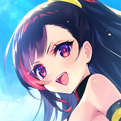
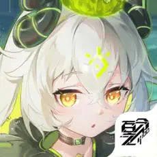
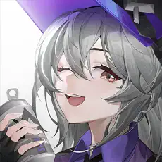
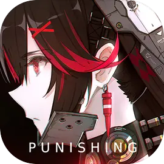
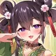
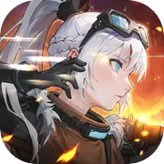

# UnityAnimeGamesInfo

A repo collecting information about anime games made with Unity.

(Only games I've dealt with))

## Games

| Name | Unity Version | Assets Encryption Method | Hotfix | so protect |
|------|---------------|--------------------------|---------|------------|
| [碧蓝航线(Azur Lane)](Info/AzurLane/AzurLane.md) | 2020.3.48f1 | | toLua | |
| [PotK -Alternative Imitation-](Info/AlternativeImitation/AlternativeImitation.md) | 2019.4.35f1 | | | | |
| [百分之一](Info/OnePercent/OnePercent.md) | 2019.4.40f1c1 | no encryption but use DB store assets | | |
| [交错战线(CrossCore)](Info/CrossCore/CrossCore.md) | 2019.4.40f1 | FakeHeader | [XLua](Info/CrossCore/CrossCore.md#luascripts) | |
| 苍雾残响 | 2020.3.7f1 | | XLua | |
| [绯染天空(Heaven Burns Red)](Info/HeavenBurnsRed/HeavenBurnsRed.md) | 2020.3.15f2 | CRC校验 | XLua | tprt(国服) |
| [雷索纳斯(Resournance)](Info/Resournance/Resournance.md) | 2019.4.40f1c1 | [UnityCN](Info/UnityCN/UnityCN.md) | [XLua(luac 5.3)](Info/Resournance/Resournance.md#xlua) | |
| MementoMori: AFKRPG | 2021.3.10f1 | | | | |
| [闻姬起舞(How To Raise A Harem)](Info/HTRAH/HTRAH.md) | 2021.3.31f1 | | XLua | |
| [云图计划(Neural Cloud CN)](Info/NeuralCloudCN/NeuralCloudCN.md) | 2018.4.36f1 | [UnityCN](Info/UnityCN/UnityCN.md) | [XLua(luac 5.3)](Info/NeuralCloudCN/NeuralCloudCN.md#xlua)	 | tprt | |
| [忘却前夜(Morimens)](Info/Morimens/Morimens.md) | 2019.4.30f1 | | XLua | |
| [环行旅舍(Kleins)](Info/Kleins/Kleins.md) | 2020.3.47f1 | FakeHeader | toLua | |
| 战双帕弥什(Punishing Gray Raven) | 2018.4.30f1 | [UnityCN](Info/UnityCN/UnityCN.md) | XLua | tprt(安卓) | |
| [萬源聖魔錄(Orisries)](Info/Orisries/Orisries.md) | 2022.3.32f1 | AES&抹去版本 | | |
| 吟游战记 | 2022.3.6f1 | FakeHeader | toLua | | |
| 超次元女神 | 2021.3.5f1 | 抹去版本 | XLua(luac 5.4) | | |
| [锚点降临(Anchor Panic)](Info/AnchorPanic/AnchorPanic.md) | 2021.3.31f1 | FakeHeader | [XLua(lua 5.1)](Info/AnchorPanic/AnchorPanic.md#luascripts) | |

备注：
- Assets Encrypted只表示脚本以外的资产加密情况，并不是上表中的每一个游戏我都研究过lua脚本的情况。

<table>
  <tr>
    <td><a href="Info/AzurLane/AzurLane.md"></td>
    <td><a href="Info/AlternativeImitation/AlternativeImitation.md"></td>
    <td><a href="Info/OnePercent/OnePercent.md"></td>
    <td><a href="Info/CrossCore/CrossCore.m"></td>
    <td></td>
  </tr>
  <tr>
    <td><a href="Info/HeavenBurnsRed/HeavenBurnsRed.md"></td>
    <td><a href="Info/Resournance/Resournance.md"></td>
    <td></td>
    <td><a href="Info/HTRAH/HTRAH.md"></td>
    <td><a href="Info/NeuralCloudCN/NeuralCloudCN.md"></td>
  </tr>
  <tr>
    <td><a href="Info/Morimens/Morimens.md"></td>
    <td><a href="Info/Kleins/Kleins.md"></td>
    <td></td>
    <td><a href="Info/Orisries/Orisries.md"></td>
    <td></td>
  </tr>
  <tr>
    <td></td>
    <td><a href="Info/AnchorPanic/AnchorPanic.md"></td>
  </tr>
</table>